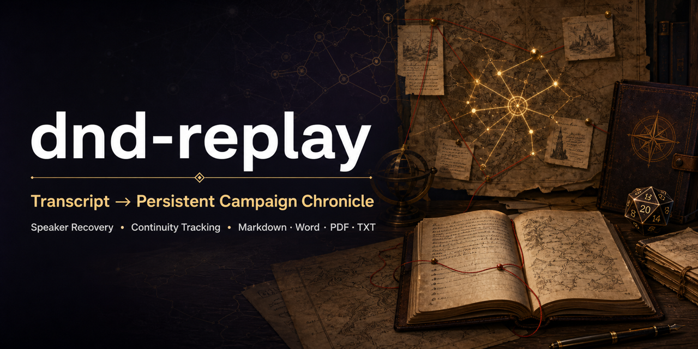

<div align="center">

# 🎲 dnd-replay

### D&D Campaign Replay & Chronicle Skill

把散乱的跑团转写，变成不会失忆的长期冒险编年史。

[](https://github.com/openai/codex)
[](https://skills.sh/yuzilan/dnd-replay/dnd-replay)
[](https://github.com/yuzilan/dnd-replay/stargazers)
[](LICENSE)

**Transcript → Adventure Reconstruction → Session Report → Campaign State → Persistent Chronicle**

</div>



---

`dnd-replay` 不是普通的跑团摘要器。它从转写、聊天记录、战斗日志与玩家笔记中还原本团真正经历的冒险，并在后续回合持续追踪角色、NPC、物品、任务、线索和谜团。

> **忠实记录玩家真正经历过的冒险，不替玩家补写一个“看起来合理”的故事。**

## Highlights

| | 能力 | | 能力 |
| --- | --- | --- | --- |
| 🎭 | 混合音轨与说话人识别 | 📚 | 长模组连续档案 |
| ⚔️ | 剧情、战斗与资源重建 | 🧩 | 线索、推测与谜团分层 |
| 🧙 | 按实际 PC 人数逐角整理 | 🔗 | NPC、物品与地点跨回串联 |
| 🛡️ | 不编造缺失事实 | 📄 | Markdown / Word / PDF / TXT |

## Install

### Skills CLI · 推荐

```bash
npx skills add yuzilan/dnd-replay -g -a codex
```

<details>
<summary>其他安装方式</summary>

#### Codex Skill Installer

在 Codex 中发送：

```text
$skill-installer 从 GitHub 仓库 https://github.com/yuzilan/dnd-replay 安装根目录的 Skill，名称设为 dnd-replay。
```

#### Git

```bash
git clone https://github.com/yuzilan/dnd-replay.git ~/.codex/skills/dnd-replay
```

</details>

安装后，在新任务中使用 `$dnd-replay`。

## Quick Start

准备一份 `.txt` / `.md` 转写或聊天记录，以及最基本的 Campaign 信息：

```text
$dnd-replay

模组：湮灭之墓
类型：长模组
进度：第 1 回
角色：玩家名｜角色名｜种族｜职业｜等级
输出：Markdown + PDF

请整理附件 transcript.txt，并为后续回合建立 Campaign Profile 与 Ledger。
```

如果资料不足，Skill 会先补问必要信息；已经提供的内容不会重复询问。

### See It Work

仓库内提供一组完全虚构的 Before / After：

- [`sample-transcript.txt`](examples/sample-transcript.txt) — 带有混合发言、战斗与识别错误的原始转写
- [`sample-session-report.md`](examples/sample-session-report.md) — 重建后的读者向战报
- [`sample-campaign-ledger.md`](examples/sample-campaign-ledger.md) — 可供后续回合延续的长期状态

### 你可以提供

- 会议或语音转写、Discord / QQ 聊天记录
- 战斗日志、VTT 导出、骰点记录
- 角色资料、玩家笔记、DM 笔记
- 模组简介与专有名词表
- 旧战报或现有 Campaign Ledger

只有音频时，请先转成文字。模组资料只用于理解背景和纠正术语，不会被当成本团已经发生的剧情。

## Campaign Workspace

原始转写属于 Campaign，**不要放进 Skill 安装目录**。推荐结构：

```text
dnd-campaigns/<campaign>/
├── campaign-profile.md
├── campaign-ledger.md
├── sources/
│   └── session-001/
│       ├── transcript.txt
│       ├── combat-log.txt
│       └── player-notes.md
├── sessions/
│   └── session-001.md
└── exports/
    ├── session-001.docx
    └── session-001.pdf
```

也可以直接在对话中上传文件，或告诉 Codex 文件现有路径，无须强制移动。

## Full Example · 《湮灭之墓》

<details>
<summary><strong>展开完整首次建档提示词</strong></summary>

```text
$dnd-replay

这是这个 Campaign 的第一次整理，请先建立 Campaign Profile，再整理第一回战报并建立长期 Ledger。

模组名称：湮灭之墓
模组类型：长模组
当前进度：第 1 回
战报格式：Markdown + PDF，并保留 Markdown 作为长期主档
玩家角色：
- 甘道夫｜剑咏法师 | 2级
- 加坦杰厄｜幽影术士 / 厨师 | 2级
- 奎萨辛娜｜暮光牧师 | 2级
- 莱纳斯｜游荡者 / 游侠 | 2级
- 隆特｜战斗大师战士 | 2级
- 罗琳｜复仇圣武士 | 2级

模组简介：
“他不是一个英雄。他只是在一个不够善良的世界里，选择做一个善良的人。”
你们站在博德之门墓园的坡地上。
棺木里躺着慧学·邓布利多——一位本地的学者。他不曾参与战争，却庇护过无数无家可归的孤儿；他不曾被人歌颂，却让许多人在动荡的岁月里感到过安稳。
他死于死亡诅咒。
他曾在战场中为了救一个孩子被亡灵撕碎，被牧师复活。那一次他回来了。而这一次，他没有。
你们因为各自的缘分来到这里——受过他的帮助、与他同行过、或只是喝过他的一碗热汤。

转写情况：整份文件只有一个说话人标签，请根据上下文保守判断；无法确定的身份请标记，不要猜。

附件：session-01-transcript.txt
```

</details>

## Continue the Campaign

后续回合只需要提供新资料：

```text
$dnd-replay 整理 sources/session-002/transcript.txt。读取现有 Profile 和 Ledger，检查连续性，生成第二回战报并更新档案。
```

历史查询同样可以直接问：

```text
$dnd-replay 这件魔法物品从哪里获得？请注明来源回合。
```

```text
$dnd-replay 汇总目前关于阿瑟瑞克的已确认线索、玩家推测和未解谜团。
```

## Output

每回完整战报包含：

1. 剧情经过
2. 各角色做了什么
3. 战斗记录
4. 装备与金钱
5. NPC 关系变化
6. 已知线索
7. 未解谜团
8. 本回名场面

并附本回结束时的队伍状态；长模组还会更新 Campaign Ledger。角色栏目严格使用实际 PC 名单，不预设固定人数。

| 格式 | 适合用途 |
| --- | --- |
| Markdown | 长期维护与版本管理 |
| Word | 编辑、批注与分享 |
| PDF | 阅读、打印与固定版式发布 |
| TXT | 纯文本与最大兼容性 |

未指定格式时，Skill 会在正式生成文件前询问；长模组可保留 Markdown 主档，再导出其他格式。

## Trust Model

```text
实际跑团记录
  > 用户明确说明
  > Campaign 历史记录
  > 模组资料
  > D&D 通用知识
  > 模型推测
```

- **已确认**：有转写、日志或用户说明支持。
- **玩家推测**：角色或玩家提出，但尚未证实。
- **无法确定**：身份、名称、数字、结果或归属存在歧义。
- **模组背景**：仅用于理解世界，不代表玩家已经知道或经历。

## Repository

```text
dnd-replay/
├── SKILL.md
├── agents/openai.yaml
├── assets/social-preview.png
├── examples/
│   ├── sample-transcript.txt
│   ├── sample-session-report.md
│   └── sample-campaign-ledger.md
└── references/
    ├── campaign-state.md
    ├── chronicle-style.md
    ├── output-formats.md
    ├── report-format.md
    └── transcript-analysis.md
```

核心入口是 [`SKILL.md`](SKILL.md)，其余文件按任务需要渐进加载。

## License

[MIT](LICENSE) © 2026 yuzilan
